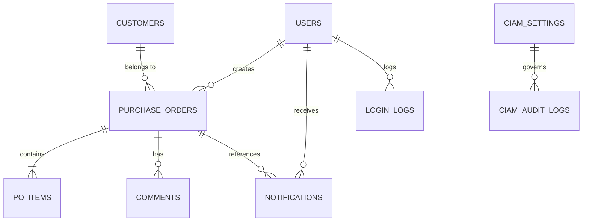

# Product Requirements Document (PRD)

# QT-Online: Quotation & Purchase Order Online Management System

**Organization:** บริษัท วินโดว์ เอเชีย จำกัด (มหาชน) / Window Asia Public Company Limited  
**Product Name:** QT-Online (PO-Online)  
**System URL:** `https://qol.windowasia.com`  
**Current Version:** 1.7.4  
**Date:** October 2026  
**Status:** In Production & Active Evolution  

---

## 1. บทนำและภูมิหลัง (Introduction & Business Background)

### 1.1 ที่มาของโครงการ
บริษัท วินโดว์ เอเชีย จำกัด (มหาชน) เป็นผู้ผลิตและจัดจำหน่ายประตูหน้าต่างอลูมิเนียมและยูพีวีซีชั้นนำ กระบวนการเสนอราคาและการจัดการคำสั่งซื้อแบบเดิมอาศัยเอกสารกระดาษหรือไฟล์ PDF แบบออฟไลน์ ซึ่งก่อให้เกิดความล่าช้าในกระบวนการขาย การติดตามสถานะเอกสาร การขออนุมัติตามลำดับขั้น และการส่งต่อให้ลูกค้าลงนามรับรอง

### 1.2 วัตถุประสงค์ของผลิตภัณฑ์ (Product Goals)
1. **เพิ่มความรวดเร็วในกระบวนการขาย (Sales Velocity):** ช่วยให้พนักงานขายสามารถเปิดใบเสนอราคา คำนวณราคาและภาษีมูลค่าเพิ่มได้อย่างถูกต้องในทันที
2. **ขจัดกระบวนการกระดาษ (Paperless Operation):** รองรับการส่งลิงก์ใบเสนอราคาให้ลูกค้าตรวจสอบและเซ็นชื่อผ่านสมาร์ตโฟน/แท็บเล็ตได้ทันที (Customer Self-Service Signing)
3. **การทำงานร่วมกันแบบ Real-time:** ฝ่ายประสานงานขาย (Sale Admin) และผู้บริหารสามารถตรวจสอบ อนุมัติ หรือขอยกเลิกเอกสารได้อย่างเป็นระบบ พร้อมการแจ้งเตือนอัตโนมัติผ่าน Telegram
4. **ความพร้อมในการเชื่อมโยงข้อมูลระดับองค์กร (Enterprise Ready):** รองรับการซิงค์ข้อมูลผู้ใช้งานกับระบบ Centralized Identity Management (CIAM) และการนำเข้าข้อมูลสินค้า/ลูกค้าจากระบบ SAP ERP ผ่าน CSV

---

## 2. กลุ่มผู้ใช้งานและบทบาท (Target Personas & User Roles)

### 2.1 Persona 1: Sale (พนักงานขาย)
- **ความต้องการ:** สร้างใบเสนอราคาได้อย่างรวดเร็ว ค้นหาสินค้าและราคามาตรฐานได้ถูกต้อง ส่งลิงก์ให้ลูกค้าเซ็นชื่อได้ทันที และดูความคืบหน้าของยอดขายเทียบกับเป้าหมาย (Target)
- **สิทธิ์:** สร้างและแก้ไขใบเสนอราคาของตนเอง, ขอยกเลิกใบเสนอราคา, แนบแผนที่และใบสั่งซื้อลูกค้า, ดูสถิติ Dashboard เฉพาะของตนเอง

### 2.2 Persona 2: Sale Admin (เจ้าหน้าที่ประสานงานขาย)
- **ความต้องการ:** ตรวจสอบความถูกต้องของใบเสนอราคาทั้งหมดในระบบ อนุมัติเอกสาร จัดการคำขอยกเลิก นำเข้าข้อมูลลูกค้าและสินค้าใหม่จาก SAP
- **สิทธิ์:** ดูใบเสนอราคาของพนักงานขายทุกคน, อนุมัติ/ปฏิเสธใบเสนอราคา, อนุมัติการยกเลิกเอกสาร, นำเข้าข้อมูลลูกค้า/สินค้าผ่าน CSV

### 2.3 Persona 3: Administrator (ผู้ดูแลระบบ)
- **ความต้องการ:** ควบคุมผู้ใช้งาน จัดการสิทธิ์ ดูแลความปลอดภัยของระบบ กำหนดค่าการเชื่อมต่อ CIAM และตรวจสอบ Audit Logs
- **สิทธิ์:** สิทธิ์ระดับสูงสุดในการจัดการ User, ตั้งค่า CIAM, เรียกดู Audit Logs / Login Logs, ล้างข้อมูลทดสอบ (Reset Transactions)

### 2.4 Persona 4: End Customer (ลูกค้าภายนอก)
- **ความต้องการ:** เปิดดูใบเสนอราคาผ่านโทรศัพท์มือถือหรือคอมพิวเตอร์ ตรวจสอบรายการสินค้า ราคารวม และเงื่อนไข โดยไม่ต้องลงทะเบียนบัญชีผู้ใช้ สามารถลงลายมือชื่อยืนยันการสั่งซื้อได้ทันที
- **สิทธิ์:** เข้าถึงเฉพาะหน้า Customer Portal ตาม Unique Access Token (UUID) เท่านั้น

### 2.5 Persona 5: Central Identity Provider (ระบบ CIAM ส่วนกลาง)
- **ความต้องการ:** ระบบ Directory Synchronization ส่วนกลางของ Window Asia ที่ต้องการบริหารจัดการสถานะการเปิด/ปิดบัญชีพนักงานอัตโนมัติผ่าน REST API

---

## 3. ขอบเขตฟังก์ชันการทำงาน (Functional Requirements)

### 3.1 ระบบยืนยันตัวตนและความปลอดภัย (Authentication & Session)
- **REQ-AUTH-01:** เข้าสู่ระบบด้วย Username และ Password (เข้ารหัสผ่านด้วย Bcrypt)
- **REQ-AUTH-02:** ระบบ Rate Limiting ป้องกันการ Brute Force (จำกัด 15 ครั้งต่อนาที)
- **REQ-AUTH-03:** บันทึกประวัติการ Login ทุกครั้งลงในตาราง `login_logs` (เก็บ Username, Client IP, User-Agent, สถานะ Success/Failed, และสาเหตุความล้มเหลว)
- **REQ-AUTH-04:** รองรับการเปลี่ยนรหัสผ่านด้วยตนเองผ่าน Modal ในหน้าแอปพลิเคชัน
- **REQ-AUTH-05:** จัดการ Session และ State ผ่าน Flask-Login พร้อมระบบป้องกันสิทธิ์ (Role-based Access Control: `@roles_required`)

### 3.2 ระบบแดชบอร์ดและการวิเคราะห์ (Dashboard & Analytics)
- **REQ-DASH-01:** สรุปยอดขายรวม (Total Amount), จำนวนเอกสารทั้งหมด (Total Documents), และจำนวนเอกสารแยกตามสถานะ (Draft, Pending Review, Approved, Rejected, Cancelled)
- **REQ-DASH-02:** แสดงความคืบหน้าของยอดขายเทียบกับเป้าหมายของพนักงานขาย (Target Amount vs Actual Amount)
- **REQ-DASH-03:** กราฟหรือแนวโน้มยอดขายรายเดือน (Monthly Sales Trend)
- **REQ-DASH-04 (Performance Mandate):** ระบบสรุปผลทั้งหมดต้องประมวลผลผ่าน **Server-side SQL Aggregation** (`COUNT`, `SUM`, `GROUP BY`) ที่ Endpoint `/api/dashboard/stats` และตอบกลับภายใน < 100 ms โดยไม่ดึงรายการ PO ทั้งหมดมาวนลูปใน Client

### 3.3 การจัดการใบเสนอราคาและคำสั่งซื้อ (Quotation & PO Lifecycle)
- **REQ-PO-01:** สร้างรหัสเอกสารอัตโนมัติในรูปแบบ `POYYMM0001` (เช่น `PO26100001`) โดยรันเลขต่อเนื่องตามเดือน
- **REQ-PO-02:** เลือกลูกค้าจากฐานข้อมูล โดยระบบจะดึงข้อมูลที่อยู่วางบิล (Bill-to) และที่อยู่จัดส่ง (Ship-to) มากรอกให้อัตโนมัติ
- **REQ-PO-03:** เพิ่มรายการสินค้า (Items) พร้อมเลือกหน่วย ระบุจำนวน ราคาต่อหน่วย ส่วนลดรายรายการ และคำนวณราคารวม
- **REQ-PO-04:** คำนวณส่วนลดท้ายบิล ยอดก่อนภาษี ภาษีมูลค่าเพิ่ม 7% (VAT 7%) และยอดสุทธิ (Grand Total)
- **REQ-PO-05:** แปลงยอดเงินสุทธิเป็นตัวอักษรภาษาไทย (`BahtText`) สำหรับระบุในใบเสนอราคาอย่างเป็นทางการ
- **REQ-PO-06:** ลายมือชื่อพนักงานขาย (Sale Signature) จะถูกนำมาประทับลงในเอกสารอัตโนมัติหากมีการตั้งค่าไว้ในโปรไฟล์
- **REQ-PO-07:** สามารถเพิ่มหมายเหตุ (Remarks) ข้อความเตือนความจำ และบันทึกประวัติการดำเนินการ (Audit Comments) ใต้เอกสาร
- **REQ-PO-08:** กรองรายการเอกสารตามเดือน (`YYYY-MM`) สถานะ และค้นหาคำสำคัญ พร้อมระบบ Pagination
- **REQ-PO-09:** ส่งออกข้อมูลใบเสนอราคาทั้งหมดเป็นไฟล์ Excel (`.xlsx`) ผ่าน Endpoint `/api/pos/export-excel`

### 3.4 วงจรสถานะเอกสารและการอนุมัติ (Status Workflow)
```
  [ Draft ] ──(ส่งตรวจ/ขออนุมัติ)──> [ Pending Review ] ──(อนุมัติ/เซ็นแล้ว)──> [ Approved ]
      │                                   │
      │                                   └──(ปฏิเสธ)──> [ Rejected ]
      ▼
  [ Request Cancellation ] ──(Sale Admin/Admin อนุมัติ)──> [ Cancelled ]
```
- **Draft:** ร่างเอกสาร สามารถแก้ไขหรือลบได้
- **Pending Review:** ส่งให้ลูกค้าหรือผู้มีอำนาจพิจารณา
- **Approved:** เอกสารได้รับการลงนามเรียบร้อย มีผลผูกพันทางธุรกิจ
- **Rejected:** เอกสารไม่ผ่านการพิจารณา พร้อมระบุเหตุผล
- **Request Cancellation:** พนักงานขายส่งคำขอยกเลิกพร้อมระบุเหตุผล (`cancelReason`)
- **Cancelled:** เอกสารได้รับการยกเลิกโดยสมบูรณ์ (ไม่นำมาคำนวณในยอดขายสุทธิ)

### 3.5 พอร์ทัลลูกค้าและการลงลายมือชื่อดิจิทัล (Customer Portal & Digital Signing)
- **REQ-PORTAL-01:** ทุกใบเสนอราคาที่สร้างขึ้นจะได้รับ Access Token รูปแบบ UUID เฉพาะตัว (สุ่มยากและปลอดภัย)
- **REQ-PORTAL-02:** ลูกค้าเข้าถึงเอกสารผ่าน URL `https://qol.windowasia.com/p/<token>` หรือสแกน QR Code จากใบเสนอราคา
- **REQ-PORTAL-03:** หน้าพอร์ทัลถูกออกแบบให้ Responsive แสดงผลสวยงามบนสมาร์ตโฟน แท็บเล็ต และคอมพิวเตอร์
- **REQ-PORTAL-04:** มี Canvas Pad สำหรับลงลายมือชื่อดิจิทัล รองรับการสัมผัสผ่านหน้าจอ (Touch Event) และเมาส์
- **REQ-PORTAL-05:** เมื่อลูกค้ากดยืนยันการเซ็นชื่อ:
  - บันทึกลายเซ็นลงในฐานข้อมูล
  - เปลี่ยนสถานะเอกสารเป็น `Approved`
  - สร้างไฟล์เอกสาร PDF พร้อมประทับตราและลายเซ็นโดยใช้ WeasyPrint
  - ส่งข้อความแจ้งเตือนผ่าน Telegram เข้ากลุ่มงานทันที
- **REQ-PORTAL-06:** ลูกค้าสามารถกดดาวน์โหลดไฟล์เอกสาร PDF ฉบับสมบูรณ์ได้ทันทีผ่าน Endpoint `/p/<token>/pdf`

### 3.6 ระบบแนบไฟล์เอกสารและพิกัดลูกค้า (Customer Document Upload)
- **REQ-DOC-01:** **แผนที่และพิกัดจัดส่ง (Customer Location):** รองรับไฟล์ PDF, JPG, PNG, GIF ขนาดไม่เกิน 10MB
- **REQ-DOC-02:** **เอกสารคำสั่งซื้อทางการ (Customer PO File):** แนบไฟล์คำสั่งซื้อที่ลูกค้าออกให้
- **REQ-DOC-03:** ระบบทำการบีบอัดไฟล์ภาพ (Image Compression via Pillow) และบีบอัด PDF (via pypdf) อัตโนมัติก่อนจัดเก็บ เพื่อประหยัดพื้นที่ดิสก์และเพิ่มความเร็วในการดาวน์โหลด
- **REQ-DOC-04:** ฝ่ายขายและแอดมินสามารถเปิดดูตัวอย่าง (Preview) และลบเอกสารที่แนบได้

### 3.7 การจัดการข้อมูลลูกค้าและสินค้า (Customers & Products)
- **REQ-MASTER-01:** จัดการข้อมูลลูกค้า รองรับฟิลด์ข้อมูลตามมาตรฐาน SAP Business One (40+ คอลัมน์) เช่น รหัสลูกค้า, กลุ่ม, เครดิตเทอม, เลขประจำตัวผู้เสียภาษี, และที่อยู่แบบ JSON
- **REQ-MASTER-02:** จัดการข้อมูลสินค้า รหัสสินค้า, ชื่อสินค้า, ราคากลาง, ราคาทุน, จำนวนสต็อก, สถานะการใช้งาน (Active/Inactive), และรูปภาพสินค้า
- **REQ-MASTER-03:** รองรับการดาวน์โหลดเทมเพลต CSV และนำเข้าข้อมูลจำนวนมาก (Bulk CSV Import)
- **REQ-MASTER-04:** หน้าแสดงผลลูกค้ารองรับการโหลดแบบรวดเร็วผ่าน `load_only` (เลือกเฉพาะคอลัมน์สรุป) และ Pagination เริ่มต้น 50 รายการ

### 3.8 ระบบการแจ้งเตือน (Notifications & Telegram Bot)
- **REQ-NOTI-01:** มี In-App Notification Center พร้อมตัวเลข Badge นับจำนวนที่ยังไม่ได้อ่าน
- **REQ-NOTI-02:** ส่งข้อความแจ้งเตือนผ่าน Telegram Bot อัตโนมัติเมื่อ:
  - มีการสร้างใบเสนอราคาใหม่
  - มีการแก้ไขใบเสนอราคา
  - มีการส่งคำขอยกเลิกเอกสาร
  - ลูกค้าลงลายมือชื่อผ่านพอร์ทัลสำเร็จ
- **REQ-NOTI-03 (Performance Mandate):** การส่งข้อความ Telegram จะต้องส่งผ่าน **Background Daemon Thread** (`threading.Thread`) เสมอ เพื่อไม่ให้ Block กระบวนการบันทึกข้อมูลหลัก

### 3.9 การเชื่อมต่อระบบตัวตนส่วนกลาง (CIAM Integration)
- **REQ-CIAM-01:** เปิด API Endpoint `/api/v1/directory/accounts` สำหรับระบบ Identity Provider ส่วนกลาง
- **REQ-CIAM-02:** ควบคุมความปลอดภัยด้วย `X-Management-API-Key` และ Whitelisted IPs จากตาราง `ciam_settings`
- **REQ-CIAM-03:** รองรับการดึงรายชื่อผู้ใช้ ค้นหา กรองสถานะ และแบ่งหน้า
- **REQ-CIAM-04:** รองรับคำสั่ง `PATCH /api/v1/directory/accounts/<username>/status` เพื่อระงับหรือเปิดใช้งานบัญชีพนักงานทันทีเมื่อมีการเปลี่ยนแปลงในองค์กร
- **REQ-CIAM-05:** บันทึกประวัติการเรียกใช้ API ทุกครั้งลงในตาราง `ciam_audit_logs`

---

## 4. ข้อกำหนดคุณสมบัติที่ไม่ใช่ฟังก์ชัน (Non-Functional Requirements)

### 4.1 ประสิทธิภาพ (Performance Requirements)
- **เวลาตอบสนองของหน้าจอ (Page Load Time):** ไฟล์หน้าเว็บหลัก (`app.html`) ต้องเปิดใช้งาน Gzip Compression ลดขนาดจาก > 450 KB เหลือ < 50 KB และโหลดเสร็จภายใน < 1 วินาที
- **การประมวลผลคำสั่งบันทึก (Save Operation):** ปุ่มบันทึก QT ต้องใช้เวลา < 300 ms โดยใช้การส่ง Telegram แบบ Asynchronous และการ Query สินค้าแบบ Batch
- **การเรนเดอร์ข้อมูลบนเบราว์เซอร์ (DOM Rendering):** ตารางที่มีข้อมูลจำนวนมากต้องใช้การประกอบ HTML String ก้อนเดียว (Single Reflow Batch Injection) แทนการวนลูป `innerHTML +=`
- **Database Connection Pooling:** กำหนดค่า `pool_pre_ping=True` และ `pool_recycle=1800` เพื่อป้องกันปัญหา Connection ดับและ Socket Timeout

### 4.2 ความปลอดภัย (Security Requirements)
- การเข้าถึงระบบผ่านเครือข่ายภายนอกต้องผ่าน **HTTPS / TLS** เท่านั้น (จัดการผ่าน Traefik Let's Encrypt Certificate)
- รหัสผ่านพนักงานต้องเข้ารหัสทางเดียวด้วย Bcrypt พร้อม Salt
- ลายมือชื่อพนักงานและลูกค้าต้องถูกจัดเก็บอย่างปลอดภัย
- ลิงก์ภายนอกของลูกค้าใช้รหัสผ่านชั่วคราว UUIDv4 ที่มีความสุ่มสูง ป้องกันการคาดเดารหัส
- มี ProxyFix ดักจับ Client Real IP ที่แท้จริงเพื่อใช้ในการ Rate Limiting และ Audit Trail

### 4.3 ความพร้อมใช้งานและการสำรองข้อมูล (Reliability & Disaster Recovery)
- ระบบรันอยู่บน Docker Container พร้อมนโยบาย `restart: always`
- ฐานข้อมูล PostgreSQL แยก Volume อิสระ (`qt-online_qt_db_data`) ป้องกันข้อมูลสูญหายเมื่อคอนเทนเนอร์หยุดทำงาน
- มีสคริปต์สำรองข้อมูลฐานข้อมูลอัตโนมัติ (`pg_dumpall`) ก่อนการ Deploy ทุกครั้ง

---

## 5. แผนผังความสัมพันธ์ของข้อมูล (Data Entity Relationship)



---

## 6. ตัวชี้วัดความสำเร็จของโครงการ (Success Metrics / KPIs)

1. **Cycle Time:** ระยะเวลาเฉลี่ยตั้งแต่เริ่มจัดทำใบเสนอราคาจนถึงลูกค้าเซ็นชื่อเสร็จสมบูรณ์ลดลงมากกว่า 70%
2. **System Availability:** ระบบมีความพร้อมใช้งาน (Uptime) ไม่น้อยกว่า 99.8% ในเวลาทำการ
3. **Response Time:** อัตราการโหลดหน้า Dashboard และบันทึกข้อมูลต้องต่ำกว่า 500 ms ใน 95% ของการใช้งาน (p95)
4. **Data Accuracy:** อัตราความถูกต้องในการคำนวณยอดเงินและภาษีมูลค่าเพิ่ม 100%
5. **Security Incident:** ไม่มีช่องโหว่ด้านการเข้าถึงข้อมูลโดยไม่ได้รับอนุญาต (Zero Unauthorized Data Breach)

---

## 7. แผนการพัฒนาและต่อยอดในอนาคต (Future Roadmap)

- [ ] **Phase 1 (Current - v1.7.4):** Performance Overhaul, CIAM Directory Integration, Batch DOM Rendering, In-app Notifications
- [ ] **Phase 2 (Next Milestone):** 
  - เชื่อมต่อ API โดยตรงกับ SAP Business One Service Layer (ไม่ต้อง Import CSV แบบ Manual)
  - รองรับระบบ Multi-currency และเงื่อนไขภาษีพิเศษ
  - เพิ่มระบบแจ้งเตือนผ่าน LINE Official Account / LINE Notify สำหรับลูกค้า
- [ ] **Phase 3:**
  - เพิ่มระบบ Workflow อนุมัติแบบหลายระดับตามวงเงิน (Multi-level Approval Matrix: เช่น ยอดเกิน 500,000 บาท ต้องผ่าน Sales Director)
  - ระบบรายงานขั้นสูงและการวิเคราะห์ข้อมูลการขายเชิงลึก (Advanced Sales Analytics & BI Dashboard)
